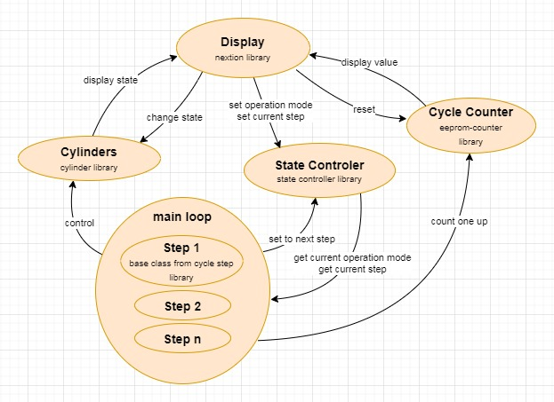

rig-template-experiment

/*
 * *****************************************************************************
 * nextion.ino
 * configuration of the Nextion touch display
 * Michael Wettstein
 * November 2018, Zürich
 * *****************************************************************************
 * an XLS-sheet to generate Nextion events can be found here:
 * https://github.com/chischte/user-interface/NEXTION/
 * *****************************************************************************
 * CONFIGURING THE LIBRARY:
 * Include the nextion library (the official one):
 * https://github.com/itead/ITEADLIB_Arduino_Nextion
 * Make sure you edit the NexConfig.h file on the library folder to set the
 * correct serial port for the display.
 * By default it's set to Serial1, which most arduino boards don't have.
 * Change "#define nexSerial Serial1" to "#define nexSerial Serial"
 * if you are using arduino uno, nano, etc.
 * *****************************************************************************
 * NEXTION SWITCH STATES LIST
 * Every nextion switch button needs a switchstate variable (bool)
 * to update the screen after a page change (all buttons)
 * to control switchtoggle (dualstate buttons)
 * to prevent screen flickering (momentary buttons)
 * *****************************************************************************
 * VARIOUS COMMANDS:
 * CLICK A BUTTON:
 * Serial2.print("click bt1,1");
 * send_to_nextion();
 * A switch (Dual State Button)will be toggled with this command
 * a Button will be set permanently pressed)
 * Serial2.print("click b3,0");
 * send_to_nextion();
 * releases a push button again but has no effect on a dual state Button
 * HIDE AN OBJECT:
 * Serial2.print("vis t0,0");
 * send_to_nextion();
 * *****************************************************************************
 */